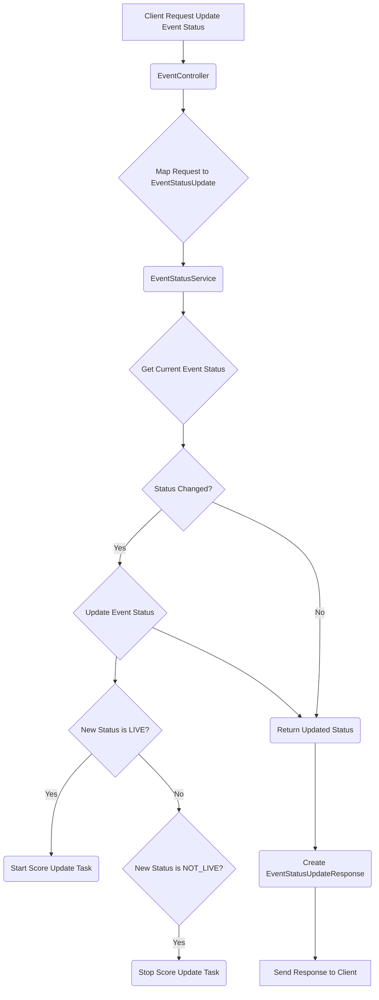
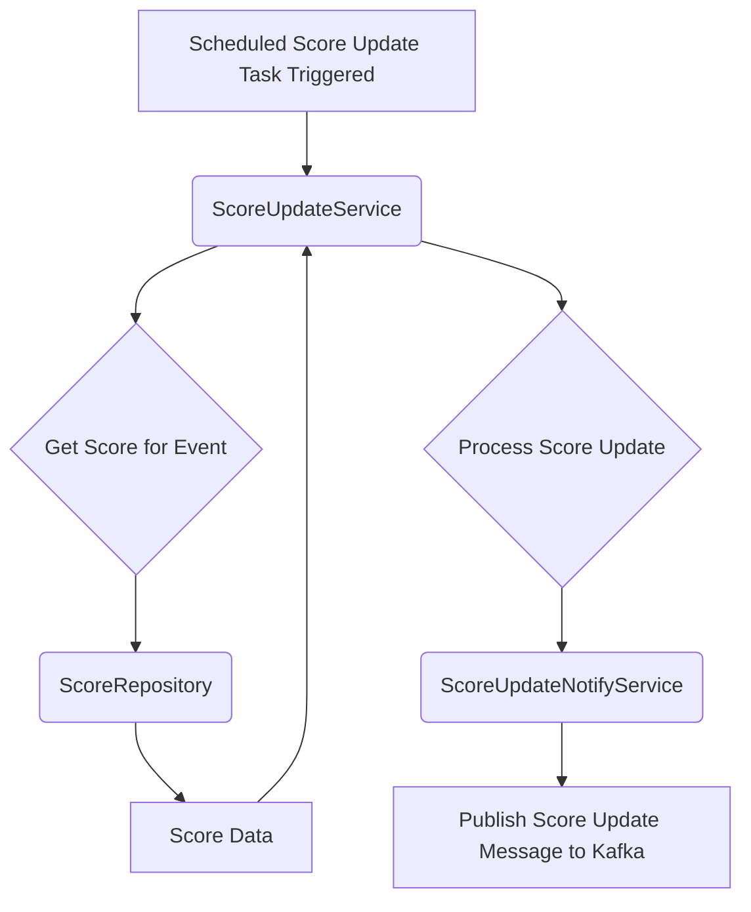

# Flows

## Flow diagram for Event Status Update

```mermaid
graph TD
    A[Client Request Update Event Status] --> B(EventController);
    B --> C{Map Request to EventStatusUpdate};
    C --> D(EventStatusService);
    D --> E{Get Current Event Status};
    E --> F{Status Changed?};
    F -- Yes --> G{Update Event Status};
    G --> H{New Status is LIVE?};
    H -- Yes --> I(Start Score Update Task);
    H -- No --> J{New Status is NOT_LIVE?};
    J -- Yes --> K(Stop Score Update Task);
    G --> L(Return Updated Status);
    F -- No --> L;
    L --> M(Create EventStatusUpdateResponse);
    M --> N[Send Response to Client];
```

---

## Flow diagram for Score Update

```mermaid
graph TD
    O[Scheduled Score Update Task Triggered] --> P(ScoreUpdateService);
    P --> Q{Get Score for Event};
    Q --> R(ScoreRepository);
    R --> S[Score Data];
    S --> P;
    P --> T{Process Score Update};
    T --> U(ScoreUpdateNotifyService);
    U --> V[Publish Score Update Message to Kafka];
```
