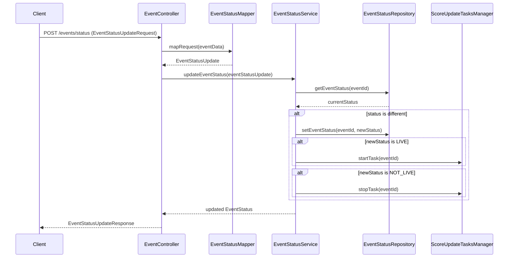
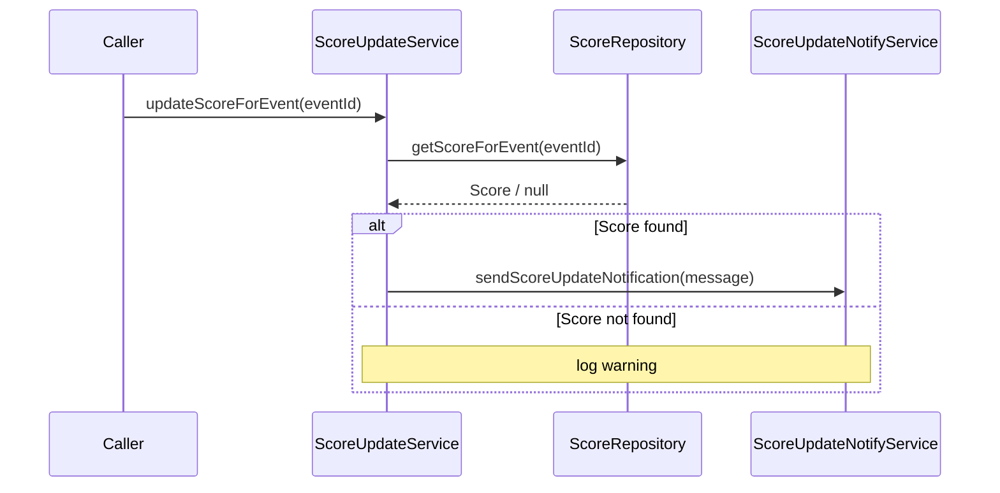

# Sequences

## Sequence diagram for Event Status Update

```mermaid
sequenceDiagram
    participant Client
    participant EventController
    participant EventStatusMapper
    participant EventStatusService
    participant EventStatusRepository
    participant ScoreUpdateTasksManager

    Client->>EventController: POST /events/status (EventStatusUpdateRequest)
    EventController->>EventStatusMapper: mapRequest(eventData)
    EventStatusMapper-->>EventController: EventStatusUpdate
    EventController->>EventStatusService: updateEventStatus(eventStatusUpdate)
    EventStatusService->>EventStatusRepository: getEventStatus(eventId)
    EventStatusRepository-->>EventStatusService: currentStatus
    alt status is different
        EventStatusService->>EventStatusRepository: setEventStatus(eventId, newStatus)
        alt newStatus is LIVE
            EventStatusService->>ScoreUpdateTasksManager: startTask(eventId)

        end
        alt newStatus is NOT_LIVE
            EventStatusService->>ScoreUpdateTasksManager: stopTask(eventId)
        end
    end
    EventStatusService-->>EventController: updated EventStatus
    EventController-->>Client: EventStatusUpdateResponse

```

---

## Sequence diagram for periodic Score Update

```mermaid
sequenceDiagram
    participant Caller
    participant ScoreUpdateService
    participant ScoreRepository
    participant ScoreUpdateNotifyService

    Caller->>ScoreUpdateService: updateScoreForEvent(eventId)
    ScoreUpdateService->>ScoreRepository: getScoreForEvent(eventId)
    ScoreRepository-->>ScoreUpdateService: Score / null
    alt Score found
        ScoreUpdateService->>ScoreUpdateNotifyService: sendScoreUpdateNotification(message)
    else Score not found
        note over ScoreUpdateService,ScoreUpdateNotifyService: log warning
    end
```

